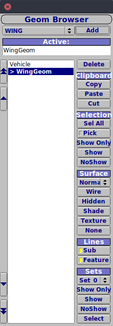
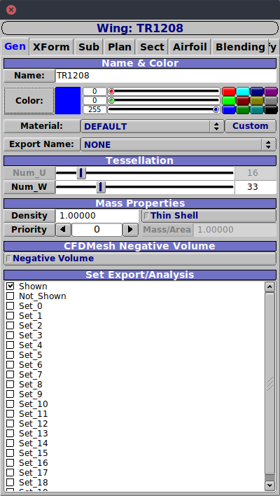
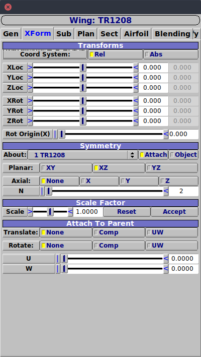
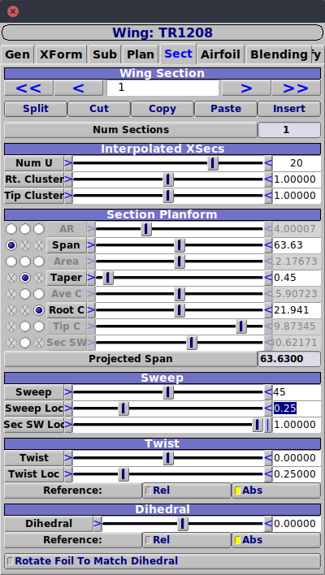
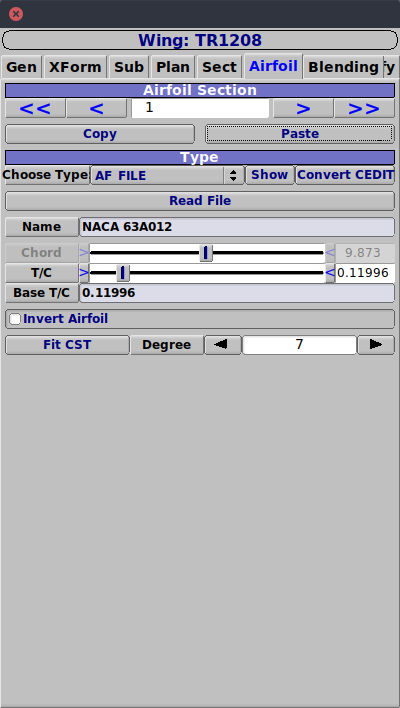
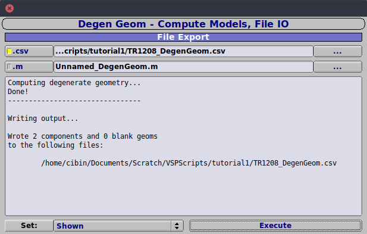
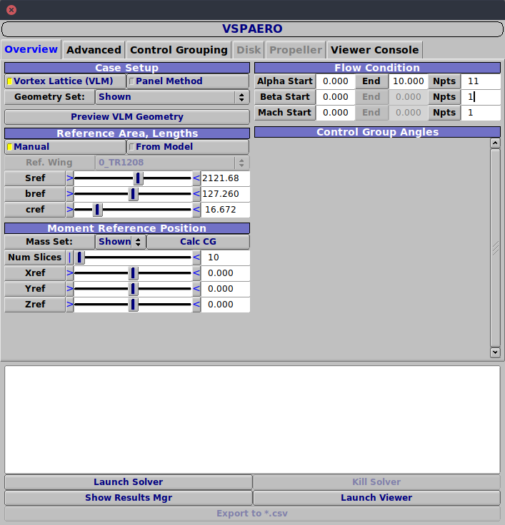
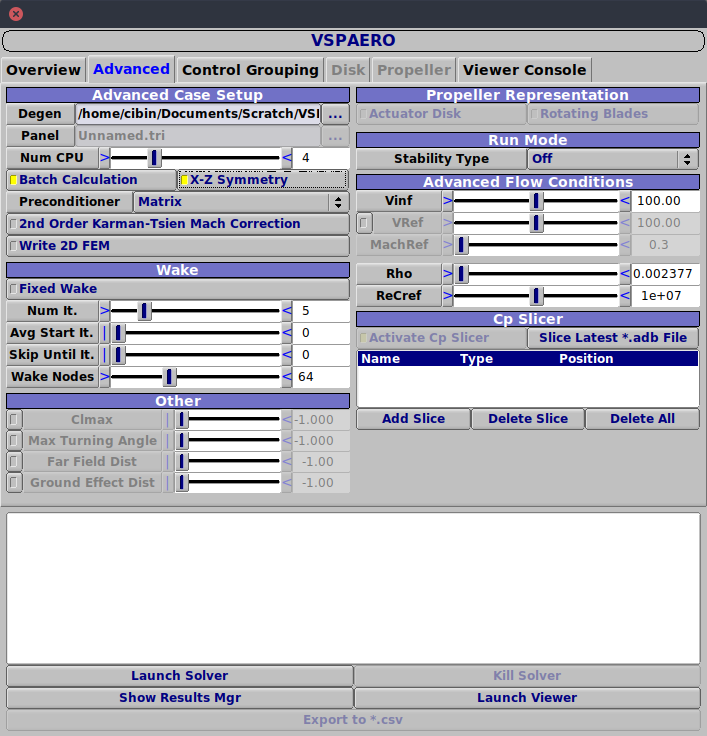
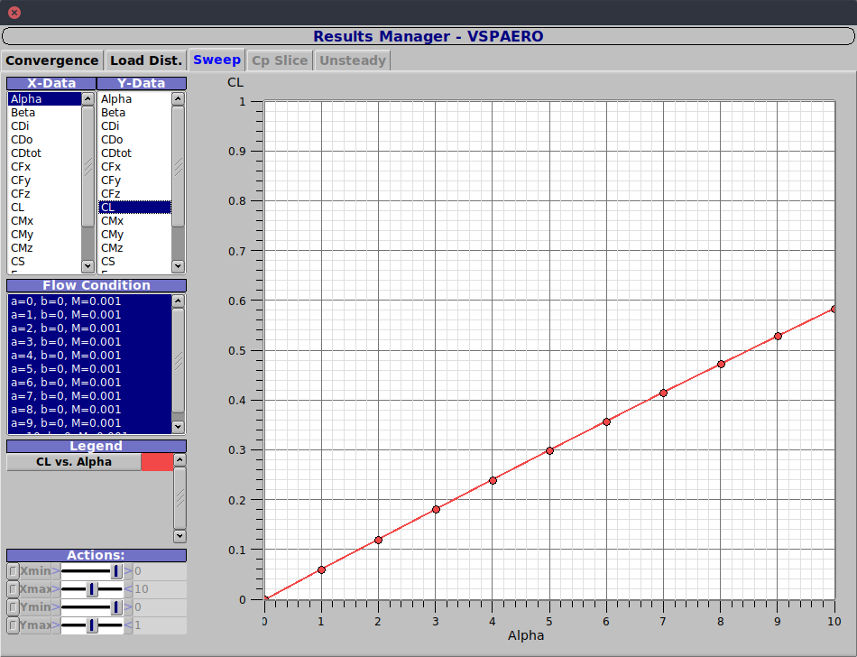
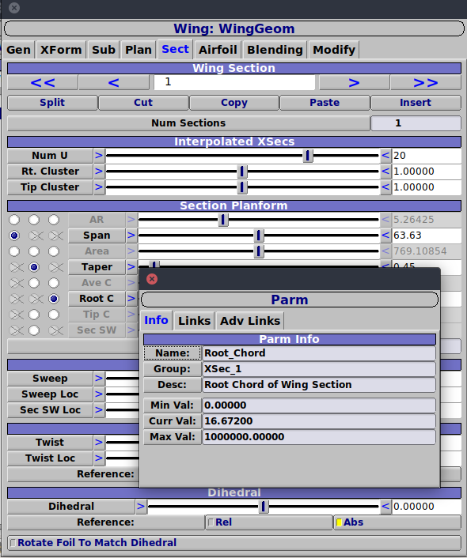

# Using the API in OpenVSP

In this introductory tutorial, we’ll perform a quick validation study on a tapered, high aspect ratio wing with a sweep angle of 45 degrees. The test case is based on experiments conducted at Langley during the early 1950s and details are available in NACA Technical Report - 1208[\[1\]](https://ntrs.nasa.gov/search.jsp?R=19930092218). 

We shall go through the process of creating the wing geometry in OpenVSP and then perform a VSPAero sweep analysis on the geometry over a range of angles of attack. First, the procedure will be described [using the GUI](#using-the-gui). These same steps will then be reproduced [using the Angelscript API](#using-angelscript-api). 

*Note*: In the following sections, elements of the OpenVSP GUI that show up as window titles or tabbed windows are shown in *italics* and buttons that need to be toggled or parameters that need to be set are shown in **bold**.

## Wing Geometry
<p align="center">
  
</p>
<p align="center">
Geometry characteristics of model (Dimensions in inches)
</p>

| **Parameter**                 |   **Value** | **Unit** | 
| :---------------------------- | ----------: | :------- | 
| Root chord                    |      21.941 | in       |         
| Semi span                     |       63.63 | in       |          
| Aspect ratio                  |        8.02 |          |       
| Taper ratio                   |        0.45 |          |      
| Wing sweep with ref. to c/4   |        45.0 | deg      |        
| Mean aerodynamic chord        |      16.672 | in       |      
| Twist                         |         0.0 | deg      |     

## Using the GUI

Here are the steps to construct the wing in the OpenVSP GUI:

1. Open a new workspace in the OpenVSP GUI.

2. In *Geom Browser*, **ADD** the **WING** type of geometry.  
   This will create a default wing and open up the *WingGeom* properties window.  

    <p align="center">
       
    </p>

3. To generate the required wing, ensure the wing is selected and in the Wing properties window that shows up, titled *Wing: WingGeom*, ensure the following parameters are set correctly in the corresponding tabs:  

    1. In *Gen*, set the **Name** to **TR1208**.

    2. In *XFORM*, ensure **Planar Symmetry** is enabled for **XZ**.

    3. In *Sub*, nothing is to be done, since we do not have subsurfaces like control surfaces.

    4. In *Plan*, we’ll leave it to default parameters since changes in the **Sect** tab will be copied over.

    5. In *Sect*,   

        - Set the number of sections along the span to **20** using the parameter **Num U**. A panel density of around 3-4 panels per unit span is a good rule of thumb for simple geometries. However, performing a basic parameter convergence study is always advisable. The number of sections, along the chord are controlled by **Num\_W** in the *Gen* tab and is left unchanged at the default value.

        - Enable the corresponding combination of the parameters and set **Span** to **63.63**, **Taper** to **0.45** and **Root C** to **21.941**. Note that, VSP allows only three parameters to be prescribed simultaneously since the others can be computed subsequently.

        - Set **Sweep** to **45**, **Sweep Loc** to **0.25** and **Sec SW Loc** to **0**.

    6. In *Airfoil*, we shall utilize an AF File to input the airfoil geometry. The AF file used here is provided in this directory. This specific airfoil may also be generated using OpenVSP, however for the purpose of this tutorial, we shall stick to the AF file method of input.
        Set **Choose type** to **AF File** and **Read File** for both *Airfoil Section* 0 and 1. 

    <p align="center">
      
    </p>  

    7. In *Blending*, leave default settings.

    8. In *Modify*, leave default settings

4. Now that the geometry has been created to specifications, let’s save it in the DegenGeom format for later use. Select *Analysis* tab in the main window, **DegenGeom** and save a **.csv** type file with the name **TR1208-DegenGeom.csv**. Save the vsp geometry as **TR1208.vsp3**, by selecting *File* and *Save*.

5. Finally, to perform a VSPAero analysis of the created wing, in the *Analysis*, select **VSPAERO**. In the *VSPAERO* window,

    <p align="center">
      
    </p>  

    1. In *Overview*, ensure **Vortex Lattice (VLM)** is selected and the reference area, **Sref** is **2121.68**, reference span, **bref** is **127.26** and reference chord, **cref** is **16.672**. **Sref** is used while computing force and moment coefficients and **bref** and **cref** are used while computing moment coefficients. The area and the chord we input are based on the mean aerodynamic chord since, for the current geometry, results are available based on these parameters.

    2. We shall perform our sweep analysis for angle of attack in the range 0 to 9 degrees using an increment of 1 degree. Ensure in *Flow Condition*, **Alpha Start** is **0.0** degrees and **Alpha End** is **9.0** degrees with **Npts** set to **10**.

    3. In *Advanced*, switch on the option **X-Z Symmetry** since our wing is symmetric about the X-Z plane. This will enable faster computation of results by utilizing the geometry on one side of the X-Z plane alone and including the influence of the other side mathematically.

6. The VSPAero solver can then be launched by clicking **Launch Solver** and should take around 10 seconds to display results.

7. We shall focus on the **CL** vs. **Alpha** plot in the *Sweep* tab of the *Results Manager - VSPAERO* window for this exercise.

    <p align="center">
     
    </p>  

## Using AngelScript API  

We shall build the script in a step-by-step manner like we did in the GUI. However, this sequence of steps is not crucial.

The script file is named `TR1208.vspscript` and can be run from the GUI using *Run Script* in the *File* tab. It can also be executed from a terminal with the command
```bash
vsp -script TR1208.vspscript
```

VSP scripts are written using the scripting library AngelScript. The syntax is very similar to C++ and the documentation for the API is available at [http://openvsp.org/api_docs/latest](http://openvsp.org/api_docs/latest). Function names will be written in `monospaced font` here. 

At any point, the `Print()` function may be used to print messages or variables to screen. In the following sections, only the relevant part of the script is shown. The complete script is provided in this directory.

1. We start by creating the `main()` function that determines the execution flow:
   ```C
   // TR1208.vspscript 
   void main()
   {
   }
   ```

2. The **WING** type of geometry is added using the function `AddGeom()`. The returned variable `myWing` is a string id that references the created wing geometry. OpenVSP also uses such string ids internally to uniquely reference geometry and parameters. Most functions in the API that change or retrieve parameters will generally have this string id as one of its arguments.
    ```C
    // Add Geometry
    string myWing = AddGeom("WING");
    ```

3. Let’s now set the required parameters of the wing.

    1. We name the wing geometry to **TR1208** using `SetGeomName()`.  
       ```C
       SetGeomName(myWing, "TR1208");
       ```

    2. We then set the X-Z symmetry flag using `SetParmVal()`. This function requires both the parameter name and the corresponding group name which contains the parameter to be specified. For obtaining these, we make use of the *Design Variables* interface in the *Model* tab from the main window of the GUI. The names may be obtained by exploring the pull-down menus or sometimes by dragging and dropping the parameter button from the GUI.

       <p align="center">
        
       </p>

       Once the parameter and group names are obtained, the value may be set for the parameter using the fourth argument. However, for certain parameters, the values are input using `Enumerators`. Enumerators are simply intuitive names given to the available values. In this case, the enumerators are `SYM_XY`, `SYM_XZ` and `SYM_YZ`. These allow setting the value to `SYM_XZ` instead of a cryptic integer or boolean value. The documentation contains details on all available enumerators.

       ```C
       // Set parameters for geometry
       SetParmVal(myWing, "Sym_Planar_Flag", "Sym", SYM_XZ);
       ```

    3. While setting the parameters of each section, ensure that the combination is valid for the driver group. The API informs VSP the parameters that are defined by the user with the function `SetDriverGroup()`. This is similar to what we did in step 3 while using the GUI.
       ```C
       // Set parameters wing section
       SetDriverGroup(myWing, 1, SPAN_WSECT_DRIVER, TAPER_WSECT_DRIVER, ROOTC_WSECT_DRIVER);
       SetParmVal(myWing, "SectTess_U", "XSec_1", 20);
       SetParmVal(myWing, "Span", "XSec_1", 63.63);
       SetParmVal(myWing, "Taper", "XSec_1", 0.45);
       SetParmVal(myWing, "Root_Chord", "XSec_1", 16.672);
       SetParmVal(myWing, "Sweep", "XSec_1", 45.0);
       SetParmVal(myWing, "Sweep_Location", "XSec_1", 0.25);
       Update();
       ```

       The variable names of the parameters may be obtained using the *Design Variables* interface or by clicking on their titles in the OpenVSP GUI. For eg. clicking on **Root C** would display the parameter name **Root\_Chord** as shown below. **XSec\_1** is the group name. Note that after setting values for the required parameters, the `Update()` function is used to ensure the values are updated.

       <p align="center">
        
       </p>  

    4. To add the airfoil file, we need to use `ReadFileAirfoil()`. However, this function requires the section id as one of the arguments. We use `GetXSecSurf()` to obtain the XSec surfaces and then `GetXSec` to obtain the required section id. `ChangeXSecShape()` is used to specify the mode of input of the XSec shape to the enumerator `XS_FILE_AIRFOIL`. The section id `xsec` is passed to `ReadFileAirfoil()` to make the changes to that section.
       ```C
       // Set airfoil section using AF file 
       string xsec_surf = GetXSecSurf(myWing, 0);
       ChangeXSecShape(xsec_surf, 0, XS_FILE_AIRFOIL);
       string xsec0 = GetXSec(xsec_surf, 0);
       ReadFileAirfoil(xsec0, "NACA63A012.af");

       ChangeXSecShape(xsec_surf, 1, XS_FILE_AIRFOIL);
       string xsec1 = GetXSec(xsec_surf, 1);
       ReadFileAirfoil(xsec1, "NACA63A012.af");

       Update();
       ```

4. Now that the geometry has been created, we shall save it in the .vsp3 format using the function `WriteVSPFile()`. The vsp3 file is named **TR1208-API.vsp3**. A CompGeom analysis also has to be performed to generate the DegenGeom file required for later VSPAero analyses. We clear our history using the function `ClearVSPModel()` and start afresh by reading the vsp3 file and performing the CompGeom analysis. The block used to perform the compgeom analysis is similar to the VSPAERO Sweep analysis explained in the next step.
   ```C
   // Save as vsp3 file and start afresh
   WriteVSPFile("TR1208-API.vsp3", SET_ALL);
   ClearVSPModel();
   ReadVSPFile("TR1208-API.vsp3");

   // Run CompGeom to generate geometry
   string compGeom = "VSPAEROComputeGeometry";
   setAnalysisInputDefaults(compGeom);
   string compGeom_results = ExecAnalysis(compGeom);
   ```

5. To perform the VSPAero analysis, we first set the type of analysis. All available analyses are exposed through the Analysis Manager functions which help setup and run various types of analyses. Invoking `SetAnalysisInputDefaults()` sets parameters to their default values. To browse alternate types of analyses, use `ListAnalysis()` as described in the documentation.
   ```C
   // Alpha Sweep analysis using VSPAero
   string myAnalysis = "VSPAEROSweep";
   SetAnalysisInputDefaults(myAnalysis);
   ```

6. Each analysis has several inputs that may be set using the functions `SetIntAnalysisInput()` or `SetDoubleAnalysisInput()` or similar, depending on the data type of the input. To display all available inputs you may use `PrintAnalysisInputs()` as shown in the comment.   
   ```C
   // List inputs, type, and current values
   // PrintAnalysisInputs(myAnalysis);
   
   // Set inputs for VSPAero
   array<int> analysis_method(1, VORTEX_LATTICE);
   SetIntAnalysisInput(myAnalysis, "AnalysisMethod", analysis_method);
   
   array<double> Sref(1, 2121.68);
   SetDoubleAnalysisInput(myAnalysis, "Sref", Sref);
   
   array<double> bref(1, 127.26);
   SetDoubleAnalysisInput(myAnalysis, "bref", bref);
   
   array<double> cref(1, 16.672);
   SetDoubleAnalysisInput(myAnalysis, "cref", cref);
   
   array<double> AlphaStart(1, 0.0);
   SetDoubleAnalysisInput(myAnalysis, "AlphaStart", AlphaStart);
   
   array<double> AlphaEnd(1, 9.0);
   SetDoubleAnalysisInput(myAnalysis, "AlphaEnd", AlphaEnd);
   
   int nAlpha = 10;
   array<int> AlphaNpts(1, nAlpha);
   SetIntAnalysisInput(myAnalysis, "AlphaNpts", AlphaNpts);
   ```

   Note that the inputs to the these functions require to be arrays and hence arrays of length 1 are used. For more details on the AngelScript syntax for declaring and initialising arrays, check the [documentation](https://www.angelcode.com/angelscript/sdk/docs/manual/doc_datatypes_arrays.html). The Vortex Lattice Method was selected using one of the enumerators initialized into an array.

7. Finally, we run the VSP solver using `ExecAnalysis()` which returns a string id that references the results generated. All operations on results are handled by the Results Manager Functions. Refer the API documentation for the complete list of available functions. We first save all generated results to csv format using `WriteResultsCSVFile()`.
   ```C
   // Run analysis and write results to CSV file
   string allResults = ExecAnalysis(myAnalysis);
   WriteResultsCSVFile(allResults, "Results.csv");
   ```

8. Let’s try printing out the converged CL values for each alpha we swept over. For this, we shall utilize the function `GetStringResults()`. This function returns an array of string ids, each of which correspond to the results of the alpha values that were iterated over during the sweep analysis. From each string id in this array, the alpha and corresponding CL values are extracted using a `for` loop.
   ```C
   // Print alpha and CL values
   array<string> sweepResults = GetStringResults(allResults, "ResultsVec");
   array<double> Alpha_res(nAlpha);
   array<double> CL_res(nAlpha);
   
   Print("");
   Print("ALPHA  |  CL");
   Print("------ | ------");
   for (uint8 i = 0; i < uint8(nAlpha); i++)
   {
     array<double> alpha_vec = GetDoubleResults(sweepResults[i], "Alpha");
     Alpha_res[i] = alpha_vec[int(alpha_vec.length()) - 1];
   
     array<double> cl_vec = GetDoubleResults(sweepResults[i], "CL");
     CL_res[i] = cl_vec[int(cl_vec.length()) - 1];
   
     Print(Alpha_res[i] + "      |   " + CL_res[i]);
   }
   ```

Note that `cl_vec` contains the CL values during each of the wake iterations and the final value is extracted and displayed as the converged result.

9. Finally, we shall also add a check for API errors at the end of the script using `GetErrorString()`.
   ```C
   // Check For API Errors
   while (GetNumTotalErrors() > 0)
   {
     ErrorObj err = PopLastError();
     Print(err.GetErrorString());
   }
   ```


### References
\[1\] Schneider, W. C., *A Comparison of the Spanwise Loading calculated by Various Methods with Experimental Loadings obtained on a 45 degree Sweptback wing of Aspect ratio 8.02 at a Reynolds number of 4.0 x 10<sup>6</sup>*. NACA Technical Report (Vol. 1208), 1951.
