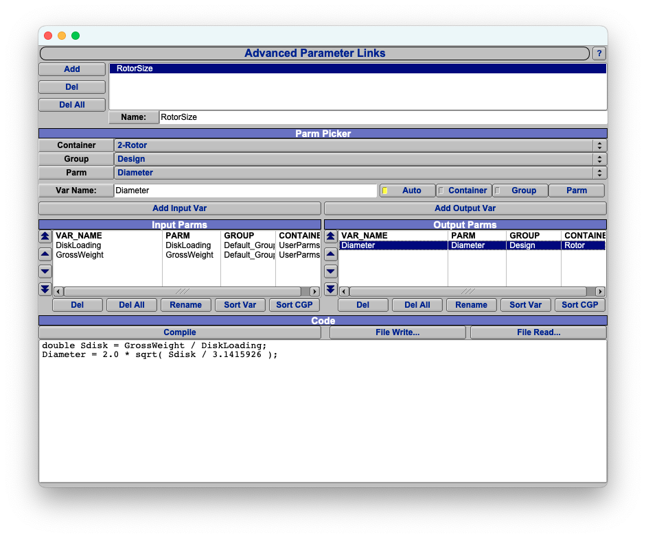

Advanced parameter linking allows the user to define mathematical relationships between arbitrary parameters.

To create an advanced link, the user first add's a link and changes the name to something apropriate.
Next, the user identifies one or more input parameters and defines a variable name to be used as an alias for each.
The user then identifies one or more output parameters and defines their aliases.  Finally, the user writes code to
define how the output parameters depend on the inputs.

Advanced linking code is written in AngelScript.  AngelScript is the scripting language embedded into OpenVSP.
AngelScript is also used for general scripting and Custom Components - consequently, the entire OpenVSP API is
available to advanced links through AngelScript.

A typical advanced link might look something like this:





This link determines the disk diameter for a vehicle given disk loading and gross weight.  OpenVSP automatically
defines the input (`GrossWeight`, `DiskLoading`) and output (`Diameter`) variables as `double` precision floating
point numbers.

Most advanced links consist of a few lines of code that use standard mathematical notation with a semicolon at
the end of each line.  This can be thought of as a subset of the AngelScript language called 'Math with Semicolons'.
The code for the example link is repeated below.

```c++
double Sdisk = GrossWeight / DiskLoading;
Diameter = 2.0 * sqrt( Sdisk / 3.1415926 );
```


## Math with Semicolons

OpenVSP automatically defines input and output variables as `double`.  These variables can be used to construct
arithmetic expressions using common mathematical notation.

| Math Operator | Meaning                                    |
|:--------------|:-------------------------------------------|
| `()`          | Expression grouping and precedence control |
| `+ -`         | Single argument positive and negative      |
| `**`          | Exponent                                   |
| `* / %`       | Multiply, divide, and modulo               |
| `+ -`         | Two argument add and subtract              |
| `=`           | Assignment                                 |

A standard suite of mathematical functions are also available.

| Math Function                      | Description                               |
|:-----------------------------------|:------------------------------------------|
| `cos(x) sin(x) tan(x)`             | Trigonometric functions (radians)         |
| `acos(x) asin(x) atan(x) atan2(x)` | Inverse trigonometric functions (radians) |
| `cosh(x) sinh(x) tanh(x)`          | Hyperbolic functions                      |
| `log(x) log10(x)`                  | Logarithmic functions                     |
| `pow(x)`                           | Exponentiation                            |
| `sqrt(x)`                          | Square root                               |
| `abs(x)`                           | Absolute value                            |
| `ceil(x)`                          | Round up                                  |
| `floor(x)`                         | Round down                                |
| `fraction(x)`                      | Fraction part                             |
| `Min(x,y) Max(x,y)`                | Minimum and maximum of two values         |
| `Rad2Deg(x) Deg2Rad(x)`            | Angle conversion                          |

Both C++ style `//` line comments and C style `/*    */` block comments are supported.

Output to the console can be easily achieved with the `Print()` function (note the capital P).  The `Print()`
functions are provided by the OpenVSP API.  They can work with various data types directly.  The lower case
`print()` function is native to AngelScript and requires additional work to format numeric variables.

## General AngelScript Programming

If using `Math with Semicolons` is insufficient for your advanced linking needs, you can also use any of the features from
AngelScript.  AngelScript is a scripting language similar to C++; it was designed to be embedded into other C++
programs.  General documentation about the
[AngelScript language](https://www.angelcode.com/angelscript/sdk/docs/manual/doc_script.html)
is available online.

### Data Types

Since OpenVSP automatically defines input and output variables as `double`, most simple scripts will not need to
define any variables at all.  If you do need to use intermediate variables, all the common data types are available.
In addition, AngelScript's `string` and `array` types are included and OpenVSP API provides `vec3d` and `matrix4d` types.


| Type          | Meaning                                |
|:--------------|:---------------------------------------|
| `bool`        | Logical true/false                     |
| `int`         | 32-bit Integer                         |
| `uint`        | 32-bit Unsigned integer                |
| `float`       | Single precision floating point number |
| `double`      | Double precision floating point number |
| `string`      | String                                 |
| `array < T >` | Array of type T                        |
| `vec3d`       | 3D Vector                              |
| `matrix4d`    | Transformation matrix                  |


### Operators and Order of Operations

AngelScript has a comprehensive set of operators expanded from those available in C++.
In expressions, the operator with the highest precedence is always computed first.
Parenthesis can be used to group expressions and to override the default precedence.

#### Unary operators

Unary operators have the higher precedence than other operators, and between unary operators the operator closest to
the actual value has the highest precedence. Post-operators have higher precedence than pre-operators.

| Operator   | Meaning                      |
|:-----------|:-----------------------------|
| `::`       | Scope resolution operator    |
| `[]`       | Indexing operator            |
| `++ --`    | Post increment and decrement |
| `.`        | Member access                |
| `++ --`    | Pre increment and decrement  |
| `not !`    | Logical not                  |
| `+ -`      | Unary positive and negative  |
| `~`        | Bitwise complement           |
| `@`        | Handle of                    |


#### Binary and ternary operators

This list shows the dual and ternary operator precedence in decreasing order.

| Operator                                      | Meaning                                             |
|:----------------------------------------------|:----------------------------------------------------|
| `**`                                          | Exponent                                            |
| `* / %`                                       | Multiply, divide, and modulo                        |
| `+ -`                                         | Add and subtract                                    |
| `<< >> >>>`                                   | Left shift, right shift, and arithmetic right shift |
| `&`                                           | Bitwise and                                         |
| `^`                                           | Bitwise xor                                         |
| `\|`                                          | Bitwise or                                          |
| `<= < >= >`                                   | Comparison                                          |
| `== != is !is xor ^^`                         | Equality, identity, and logical exclusive or        |
| `and &&`                                      | Logical and                                         |
| `or \|\|`                                     | Logical or                                          |
| `?:`                                          | Condition                                           |
| `= += -= *= /= %= **= &= \|= ^= <<= >>= >>>=` | Assignment and compound assignments                 |

### Control Flow

All of the looping and branching constructs from C++ are available in AngelScript.  Users should be careful
when using these constructs as it is possible to make computationally expensive (slow) advanced links, including
advance links that enter into infinite loops.

Examples of the most common control flow constructs are given below.

```c++
if ( condition1 )
{
    // Do something if condition1 is true.
}

if ( condition2 )
{
    // Do something if condition2 is true.
}
else if ( condition 3 )
{
    // Do something if condition2 is false, but condition 3 is true.
}
else
{
    // Do something if both condition2 and condition3 are false.
}

int n = 5;
for ( int i = 0; i < n; i++ )
{
    // Do something five times.
}
```

### Arrays

AngelScript's `array` are very similar to C++ STL's `vector`; they provide a dynamic container with random access.
A summary of the methods available to work with `array` is given below.

| Method                                            | Meaning                        |
|:--------------------------------------------------|:-------------------------------|
| `x[i];`                                           | Access element                 |
| `array < T > x;`                                  | Declaration                    |
| `array < T > x = {1.2, 2.3, 3.4};`                | Declaration & initialization   |
| `T[] x;`                                          | Declaration                    |
| `T[] x = {1.2, 2.3, 3.4};`                        | Declaration & initialization   |
| `uint size();`                                    | Array size                     |
| `bool empty();`                                   | Test for empty array           |
| `void push_back( const T &in );`                  | Place value after end of array |
| `void pop_back();`                                | Remove final value from array  |
| `void insert( uint index, const T &in value );`   | Insert value at index          |
| `void insert( uint index, const array<T>& arr );` | Insert arr at index            |
| `void erase( uint index );`                       | Remove value at index          |
| `void reserve( uint length );`                    | Reserve memory for array       |
| `void resize( uint length );`                     | Resize array                   |
| `void reverse();`                                 | Reverse elements in array      |


### OpenVSP Types

The `vec3d` and `matrix4d` types provided by the OpenVSP API are helpful for working with 3D position and direction
vectors and also transformation matrices.  The `vec3d` class performs vector math of various kinds including
addition, scalar multiplication, dot and cross products, point projection, etc.
The [complete vec3d documentation](https://openvsp.org/api_docs/latest/classvec3d.html) is available online.

The `matrix4d` class provides an augmented transformation matrix used to perform rotations, translations, scaling,
projections, and other transformations in 3D space.
The [complete matrix4d documentation](https://openvsp.org/api_docs/latest/class_matrix4d.html) is available online.

### OpenVSP API

The entire OpenVSP API is available for use from advanced links.
The [complete OpenVSP API documentation](https://openvsp.org/api_docs/latest/) is available online.

### AngelScript API

The official [AngelScript language documentation](https://www.angelcode.com/angelscript/sdk/docs/manual/doc_script.html)
is available online.  Angelscript comes with several optional packages that can be installed.  Below is a table of
the optional components installed in OpenVSP and a link to the documentation of each one.


| AngelScript Module | Purpose                                                                                                  |
|:-------------------|:---------------------------------------------------------------------------------------------------------|
| `stdstring`        | [String object](https://www.angelcode.com/angelscript/sdk/docs/manual/doc_script_stdlib_string.html)     |
| `array`            | [Array template object](https://www.angelcode.com/angelscript/sdk/docs/manual/doc_datatypes_arrays.html) |
| `any`              | [Any container](https://www.angelcode.com/angelscript/sdk/docs/manual/doc_addon_any.html)                |
| `file`             | [File I/O](https://www.angelcode.com/angelscript/sdk/docs/manual/doc_script_stdlib_file.html)            |
| `math`             | [Math](https://www.angelcode.com/angelscript/sdk/docs/manual/doc_addon_math.html)                        |
| `builder`          | [Script Builder](https://www.angelcode.com/angelscript/sdk/docs/manual/doc_addon_build.html)             |
| `filesystem`       | [Filesystem](https://www.angelcode.com/angelscript/sdk/docs/manual/doc_script_stdlib_filesystem.html)    |
| `datetime`         | [Date and Time](https://www.angelcode.com/angelscript/sdk/docs/manual/doc_script_stdlib_datetime.html)   |
| `aswrappedcall`    | [Auto Wrapper](https://www.angelcode.com/angelscript/sdk/docs/manual/doc_addon_autowrap.html)            |
| `stdstring_utils`  | [String Utilities](https://www.angelcode.com/angelscript/sdk/docs/manual/doc_script_stdlib_string.html)  |

Note: OpenVSP compiles AngelScript with the `#define AS_USE_STLNAMES=1` option enabled.  This causes the `stdstring` and `array`
modules to behave more like their C++ STL equivalents.

Note: OpenVSP registers the `array` package with the `defaultArray=true` option enabled.  This causes `array` to accept
declarations in the form `T[] arr;`.
