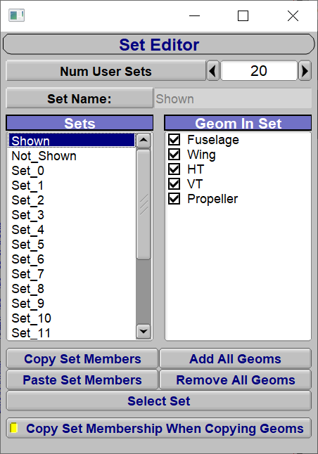
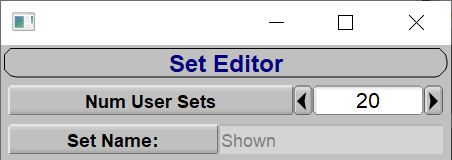
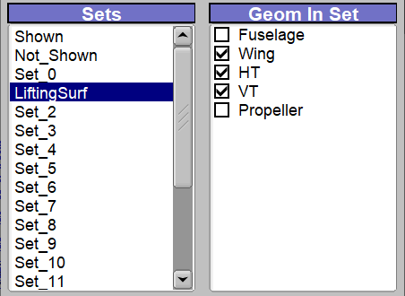
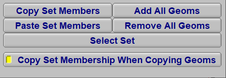

OpenVSP Sets enable a user to group components together and perform a wide range of actions or functions. Examples
include show/hide, export, and analyses.  The Set Editor GUI allows a user to quickly add, remove, and copy components
to a set.  Default set names may be customized and the number of available sets increased, and components within a set may
be selected from within the Set Editor.

The Set Editor can be access via the Model menu and looks like this:

## Set Editor Header

The Set Editor header contains two elements: `Num User Sets` and `Set Name:`. A user may increase the number of sets
available in the model, with the minimum number of sets being 20.  The Set Name dialogue box indicates what set in the
set editor is selected, and allows the user to rename the selected set using a string input. Note, sets "Shown" and
"Not_Shown" are protected and may not be renamed.

## Set Editor Body

Users may select sets in the Sets window of the Set Editor body and view the model components that are contained in the
set via the Geom in Set window. Components with a check mark are included in a set. Components may be manually added or
removed by clicking the check box next to the component name in the Geom in Set window.

In the figure below, a custom named "LiftingSurf" set has been selected and the components "Wing", "HT", and "VT" are
included in the selected set.

## Set Editor Footer

A set of buttons in the footer of the Set Editor enables users to Copy and Paste set component members between different
sets, or add/remove all component members from a set. The `Select Set` button allows the user to select the geometry
components in the OpenVSP model. For example, with the LiftingSurf set selected in the Sets window, clicking the Select
Set button will select the geometry components within the OpenVSP model. The `Copy Set Membershipt When Copying Geoms`
toggle button enables or disables a copied component to retain its set membership. For example, the "Wing" component can
be copied and pasted within the OpenVSP model and the new wing will, when enabled, retain membership in the "LiftSurf" set.

