Stack Presets can be used to initialize the current stack into a variety of useful starting configurations.
Some of these presets are convenience features, such as *Default* and *Cylinder*. They get the user to a helpful
starting point for modeling geometry. The other presets are to assist with engine modeling. OpenVSP supports
a variety of engine representations, which have subtle but important differences. These differences appear both in the
geometric modeling as well as in the various parms required to set up a nacelle for analyses. Given that there are
many valid permutations of full nacelle, inlet, and/or outlet modeling methods, a sampler of nacelle presets are
included to jump off from when developing vehicle with propulsion modeling.

| Stack Presets                                                      | Order Policy |
|:-------------------------------------------------------------------|:-------------|
| [Default](#default)                                                | Free         |
| [Cylinder with End Points](#cylinder-with-end-points)              | Free         |
| [Cylinder with End Caps](#cylinder-with-end-caps)                  | Free         |
| [Nacelle Flowthru Outlet Origin](#nacelle-flowthru-outlet-origin)  | Loop         |
| [Nacelle Flowthru Inlet Origin](#nacelle-flowthru-inlet-origin)    | Loop         |
| [Nacelle Flowthru Mid Origin](#nacelle-flowthru-mid-origin)        | Loop         |
| [Nacelle Inlet + Outlet to Face](#nacelle-inlet-outlet-to-face)    | Loop         |
| [Nacelle Inlet Lip + Outlet Face](#nacelle-inlet-lip-outlet-face)  | Loop         |
| [Nacelle Inlet Face + Outlet Lip](#nacelle-inlet-face-outlet-lip)  | Loop         |
| [Nacelle Inlet + Outlet to Lip](#nacelle-inlet-outlet-to-lip)      | Loop         |
| [Nacelle Outlet to Face](#nacelle-outlet-to-face)                  | Loop         |
| [Nacelle Outlet to Lip](#nacelle-outlet-to-lip)                    | Loop         |
| [Nacelle Inlet to Face](#nacelle-inlet-to-face)                    | Loop         |
| [Nacelle Inlet to Lip](#nacelle-inlet-to-lip)                      | Loop         |
| [Nacelle Flowpath Inlet + Outlet](#nacelle-flowpath-inlet-outlet)  | Loop         |
| [Nacelle Flowpath Inlet](#nacelle-flowpath-inlet)                  | Loop         |
| [Nacelle Flowpath Outlet](#nacelle-flowpath-outlet)                | Loop         |

## Free Presets
These are stack presets that use the "Free" Order Policy.

### Default
This is the default stack initialization type.

### Cylinder with End Points
A 4-XSec cylinder, with points as the start and end of the stack.
Skinning is disabled for the whole stack.

### Cylinder with End Caps
A 2-XSec cylinder, with flat end caps for the start and end of the stack.
Skinning is disabled for this stack.

## Loop Presets (Nacelles)

These are the stack presets that use the "Loop" Order Policy, given here as a variety of nacelle models.
Engine modeling in OpenVSP includes a number of subtle design choices, and not every combination of these
creates a valid or useful model. As such, we encourage users new to engine modeling to begin from one of the
included Nacelle stack presets.

There area few important concepts to cover with engine modeling.

First is Engine Definition, in which the user defines to OpenVSP *how* the engine geometry is modeled. The user may
model the flowpath (inlet and/or outlet) implicitly with the "Flowthrough" definition or explicitly as a "Flowpath"
definition. With these options selected, the user indicates the applicable engine XSecs on the stack itself, which
are automatically activated/deactivated by the prior engine definition selections.

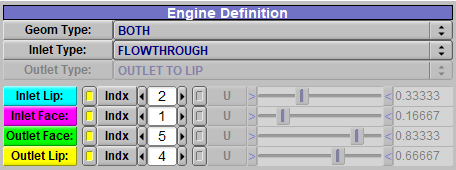

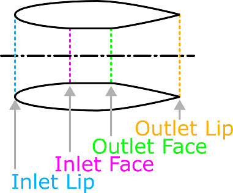

Second is Engine Representation. OpenVSP uses Engine Representation to interpret which sections of the defined engine will
be used in analyses. Once the engine is defined, there remain a subset of options on how to represent this geometry. 

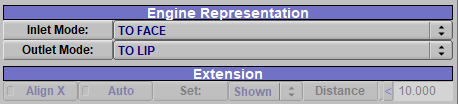

If the geometry models the nacelle explicitly, the user may flag it as a positive volume or remove it from analysis.
All except the "...Negative Only" options will keep the explicitly modeled nacelle geom, while the "Negative Only"
options discards the nacelle geom.

If the geometry implicitly models the flowpath, the user may flag it to remain an unmodeled volume or to be a negative
volume (which acts as a boolean removal tool in analyses). The user may also choose to crop the flowpath from its
maximum definition (e.g., from full inlet/outlet flowpath to inlet/outlet "To Face", or from inlet/outlet "To Face" to
inlet/outlet "To Lip" ).

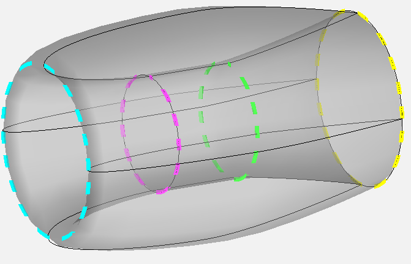

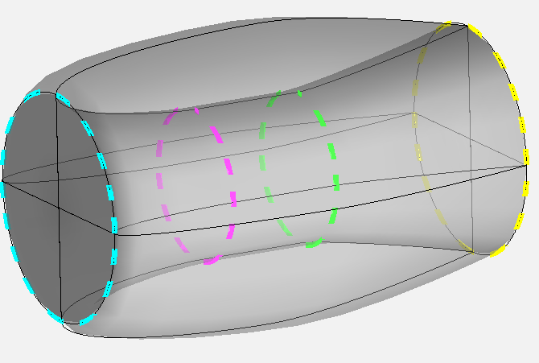

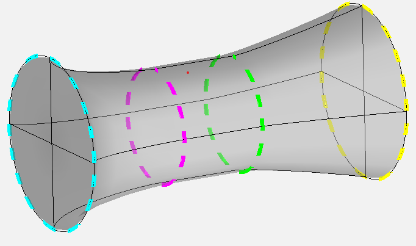

### Nacelle Flowthru Outlet Origin
This Nacelle is modeled as a "flow through" geometry, meaning the inner and outer surfaces of the nacelle
are explicitly modeled with the XSecs of the stack. The flowthrough nacelle representation offers some
flexibility here: users may choose to simply leave the interior portion of the nacelle as is, or if the
nacelle intersects with other geometry may flag the interior as "negative volume," which when performing
CompGeom or CFD work will perform a boolean cut through any other positive volume. Additionally, users may
choose to represent this nacelle using ONLY the negative volume, omitting the nacelle itself while preserving
the implicitly-modeled flow path. Users may also crop the XSecs represented to the face or lip of the inlet
or outlet, reducing the nacelle model to a non-flow through geometry. For these flowthrough geometries,
it is crucial that the order of the XSecs is back-to-front on the inner surface and front-to-back on the outer
surface. This maintains the proper surface normal. As a check, users may attach a blank geom to UW trans/rot
as a child of the geom and verify its normal direction faces out.

There are three variations on this flowthrough nacelle model, this one has the outlet as its XSec origin.

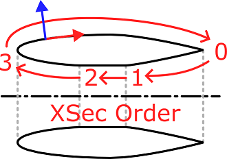

### Nacelle Flowthru Inlet Origin
This Nacelle is modeled as a "flow through" geometry, meaning the inner and outer surfaces of the nacelle
are explicitly modeled with the XSecs of the stack. The flowthrough nacelle representation offers some
flexibility here: users may choose to simply leave the interior portion of the nacelle as is, or if the
nacelle intersects with other geometry may flag the interior as "negative volume," which when performing
CompGeom or CFD work will perform a boolean cut through any other positive volume. Additionally, users may
choose to represent this nacelle using ONLY the negative volume, omitting the nacelle itself while preserving
the implicitly-modeled flow path. Users may also crop the XSecs represented to the face or lip of the inlet
or outlet, reducing the nacelle model to a non-flow through geometry. For these flowthrough geometries,
it is crucial that the order of the XSecs is back-to-front on the inner surface and front-to-back on the outer
surface. This maintains the proper surface normal. As a check, users may attach a blank geom to UW trans/rot
as a child of the geom and verify its normal direction faces out.

There are three variations on this flowthrough nacelle model, this one has the inlet as its XSec origin.

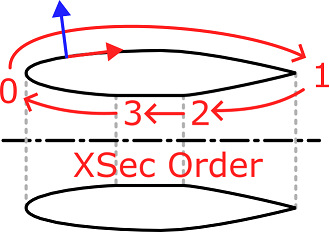

### Nacelle Flowthru Mid Origin
This Nacelle is modeled as a "flow through" geometry, meaning the inner and outer surfaces of the nacelle
are explicitly modeled with the XSecs of the stack. The flowthrough nacelle representation offers some
flexibility here: users may choose to simply leave the interior portion of the nacelle as is, or if the
nacelle intersects with other geometry may flag the interior as "negative volume," which when performing
CompGeom or CFD work will perform a boolean cut through any other positive volume. Additionally, users may
choose to represent this nacelle using ONLY the negative volume, omitting the nacelle itself while preserving
the implicitly-modeled flow path. Users may also crop the XSecs represented to the face or lip of the inlet
or outlet, or choose to extend the inlet or outlet; reducing the nacelle model to a non-flow through geometry.
For these flowthrough geometries, it is crucial that the order of the XSecs is back-to-front on the inner
surface and front-to-back on the outer surface. This maintains the proper surface normal. As a check, users
may attach a blank geom to UW trans/rot as a child of the geom and verify its normal direction faces out.

There are three variations on this flowthrough nacelle model, this one has the middle of the flowpath as its
XSec origin.

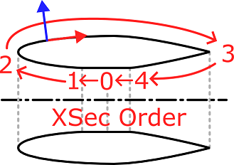

### Nacelle Inlet + Outlet to Face
This nacelle is modeled from the face of the inlet around the outside to the face of the outlet.
It does not model the flowthrough region between the inlet/outlet faces, but can model the inlet/outlet cavities
as shown or as negative volumes for CompGeom/CFD operations. Additionally, the inlets and outlets may be
overridden with an extend representation.

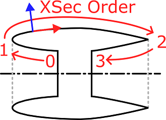

### Nacelle Inlet Lip + Outlet Face
This nacelle is modeled from the lip of the inlet around the outside to the face of the outlet.
It does not model the flowthrough region between the inlet/outlet faces, but can model the outlet cavity
as shown or as a negative volume for CompGeom/CFD operations. Additionally, the inlets and outlets may be
overridden with an extend representation.

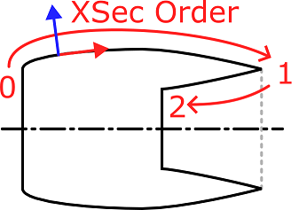

### Nacelle Inlet Face + Outlet Lip
This nacelle is modeled from the face of the inlet around the outside to the lip of the outlet.
It does not model the flowthrough region between the inlet/outlet faces, but can model the inlet cavity
as shown or as a negative volume for CompGeom/CFD operations. Additionally, the inlets and outlets may be
overridden with an extend representation.

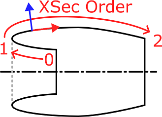

### Nacelle Inlet + Outlet to Lip
This nacelle is modeled from the lip of the inlet around the outside to the lip of the outlet.
It does not model the flowthrough region between the inlet/outlet faces, but the inlets and outlets may be
given an extend representation.

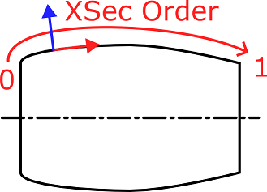

### Nacelle Outlet to Face
This nacelle is modeled as outlet-only to face of the outlet. It can model the outlet cavity
as shown or as a negative volume for CompGeom/CFD operations. The outlet may be overridden with an extend
representation.

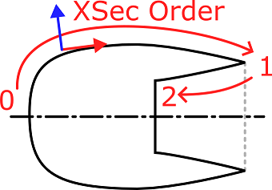

### Nacelle Outlet to Lip
This nacelle is modeled as outlet-only to lip of the outlet. The outlet may be overridden with an extend
representation.

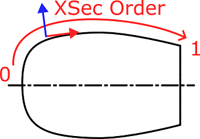

### Nacelle Inlet to Face
This nacelle is modeled as inlet-only starting from the inlet face. It can model the inlet cavity
as shown or as a negative volume for CompGeom/CFD operations. The inlet may be overridden with an extend
representation.

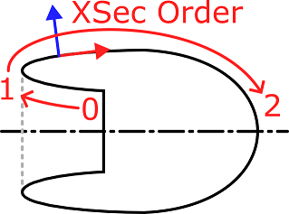

### Nacelle Inlet to Lip
This nacelle is modeled as inlet-only starting from the inlet lip. The inlet may be overridden with an extend
representation.

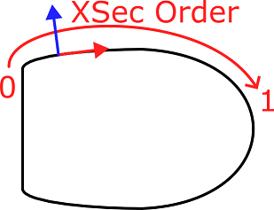

### Nacelle Flowpath Inlet + Outlet
This nacelle is explicitly modeling the interior flowpath, with no representation of the outer structure.
Note that this reverses the XSec order from the earlier paradigm, as the inlet face is the first XSec, leading
through the flowpath to the outlet face. This representation is intended to be used as a negative flowpath, with
the "negative flowpath only" option behaving identically since there is no nacelle modeled in the first place.
This model also supports extension of inlet and outlets.

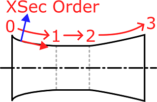

### Nacelle Flowpath Inlet
This nacelle is explicitly modeling the interior flowpath from inlet lip to inlet face, with no representation
of the outer structure. This representation is intended to be used as a negative flowpath, with the "negative
flowpath only" option behaving identically since there is no nacelle modeled in the first place. This model also
supports extension of the inlet.

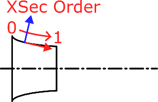

### Nacelle Flowpath Outlet
This nacelle is explicitly modeling the interior flowpath from outlet face to the outlet lip, with no representation
of the outer structure. This representation is intended to be used as a negative flowpath, with the "negative
flowpath only" option behaving identically since there is no nacelle modeled in the first place. This model also
supports extension the outlet.

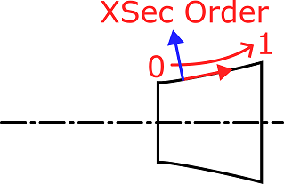